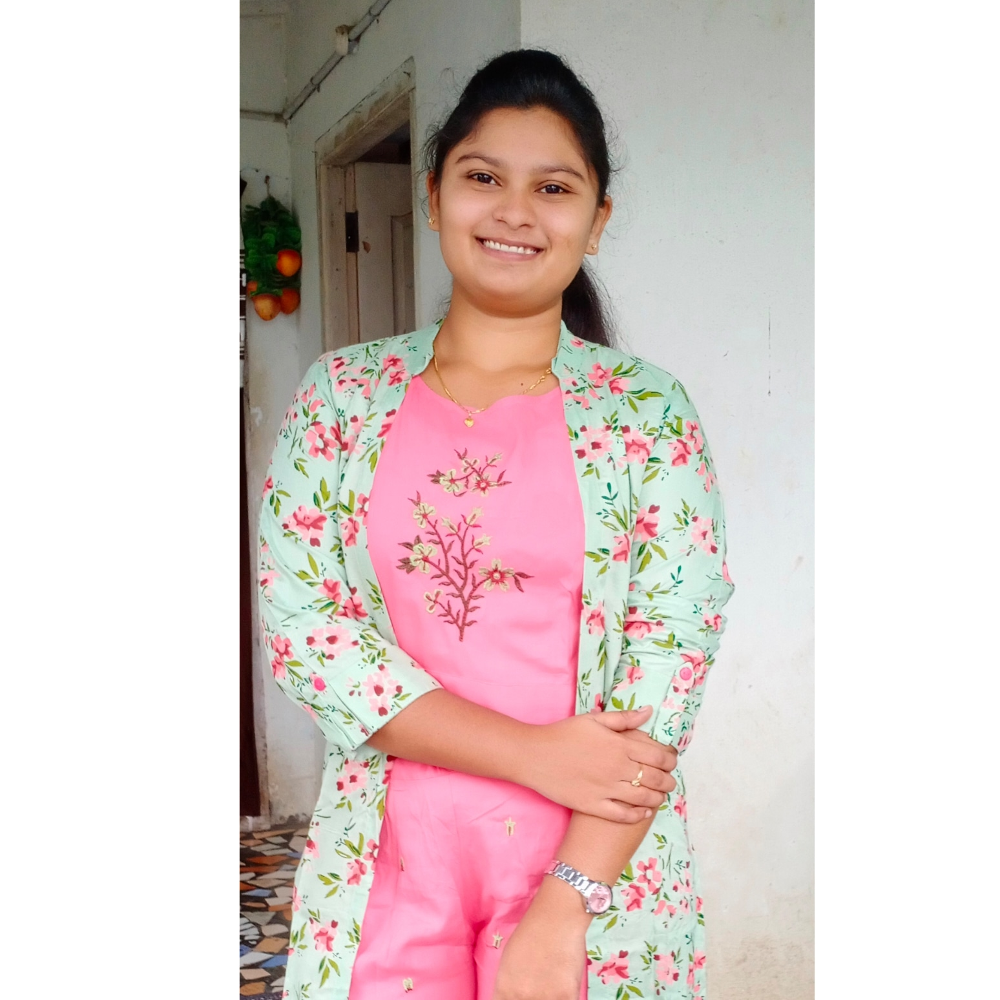

# FarmShop

## Our Project
   <strong>Project Title   :   </strong> Farm Shop 
   <strong>Project Tagline :   </strong>Shop From Anywhere 
   <strong>Team Name       :   </strong>The Taskforce Tribe 
   <strong>Logo            :  
    &nbsp;&nbsp;&nbsp;&nbsp;&nbsp;&nbsp;&nbsp;&nbsp; &nbsp;&nbsp;&nbsp;&nbsp;     </strong> 
    
## Our Team

  &nbsp;                    

[Tejo Lakshmi Tata](https://github.com/TejoTata)    &nbsp;&nbsp;&nbsp;&nbsp;&nbsp;   [Dheeraj krishna Mekala](https://github.com/dheerajkrishna458) &nbsp;&nbsp;  [Kurra kovidh](https://github.com/kurrakovidh) &nbsp;&nbsp;&nbsp;&nbsp;&nbsp;&nbsp;&nbsp;&nbsp; [Narayana Potla](https://github.com/narayanapotla1)             &nbsp;&nbsp;&nbsp;&nbsp;   [Bhavana-Malli](https://github.com/Bhavana-Malli)   

 
## Participants
|     Team Member          | Role              | 
 -------------             | :-------------:   |
| Person 1   | role |
| Person 2   | role |
| Person 3 | role  | 
| Narayana Potla | Business Analyst |  
| Tejo Lakshmi Tata        | UI Developer      |  

## Key Contributions
<li>Tejo Lakshmi Tata will be UI Developer in the team</li>
<li>contribution</li>
<li>contribution</li>
<li>contribution</li>
<li>contribution</li>

## Content Summary

## Group Plan

> Requirement Analysis
* In this group we are deciding the project and gaining basic information to develop the project.
* We find the similar implemenation for the web applications.

> Planning
* We are analysing the total budget for this project development.
* Gathering the required staff for this project
* Dividing the work to develop
* Deciding which platform to implement and work.

> Execution
* In this stage we are developing the code for the project.
* And implemeting some testcases
* Deploy the first version of project

